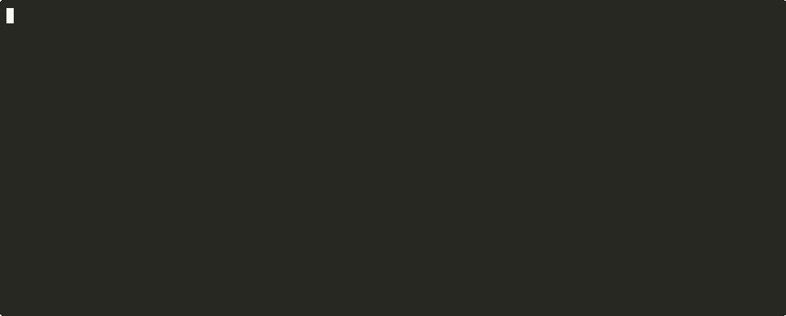

# archcheck

[](https://github.com/blurman-ai/archcheck/actions/workflows/ci.yml)
[](https://github.com/blurman-ai/archcheck/releases/latest)
[](LICENSE)

Architecture rules and drift checks for C++ CI.



*A PR introduces a copied block — `archcheck --diff` names the clone and its source, `file:line` both
ways. Output recorded verbatim from the [live demo repo](https://github.com/blurman-ai/archcheck-demo).*

## Why

C++ projects degrade over time:

- layers stop being layers
- modules start depending on everything
- include graph turns into spaghetti

Code review doesn’t catch this.
Linters don’t check architecture.
AI-assisted coding makes external structural checks more important: agents can
struggle to preserve constraints across long contexts (*constraint decay*,
[Dente et al., EURECOM, 2026](docs/research/constraint_decay.md)). The prompt
degrades with context; CI doesn’t.

**archcheck keeps the hard CI gate narrow, and reports the rest as explicit advisories.**

---

## What it does (today, v0.1)

- Scans `.h` / `.cpp` sources with a fast preprocessor pass — no `compile_commands.json` required
- Builds the include-dependency graph and detects cycles, deep chains, and god-headers
- Runs five default intrinsic rules sourced from C++ Core Guidelines and Lakos:
  - **SF.9** — no cycles in the include graph (**gating** in plain check mode)
  - **SF.7** — no `using namespace` in headers (**advisory**)
  - **SF.8** — every header has `#pragma once` or include guard (**advisory**)
  - **Lakos.GodHeader** — fan-in ≤ 50 incoming includes (**advisory** in check mode)
  - **Lakos.ChainLength** — include-chain depth ≤ 10 (**advisory**)
- Reports findings as `file:line: [rule] message`; exit `1` means a gated finding, not merely "anything was reported"
- Tracks architectural drift between graph baselines: `DRIFT.1`, `DRIFT.2`, and `DRIFT.4.CYCLE` gate; `DRIFT.3`, `DRIFT.4.NEW`, `DRIFT.4.SDP`, and pre-existing findings are advisory
- Runs the canonical PR workflow with `--diff <revspec>`: new/grown cycles and new god-headers gate, while added edges, chain/NCCD growth, SATD, test co-evolution, local complexity, flag-argument drift, and new clone drift are advisory

The current signal model:

| Layer | Examples | Exit behavior |
|-------|----------|---------------|
| Core gate | SF.9 cycles, DRIFT.1/2/4.CYCLE, `--diff` new/grown cycles and new god-headers | exit `1` |
| Structural advisories | SF.7/SF.8, Lakos chain/god-header in check mode, added edges, NCCD/chain growth | reported, exit `0` |
| PR hygiene advisories | SATD, test co-evolution, local complexity, flag arguments, new clones | reported, exit `0` |
| History analytics | `--history` god-file growth and defect-attractor signals | report-only, exit `0` |

---

## Live demo

See the new-clone gate fire on real pull requests:
**[blurman-ai/archcheck-demo](https://github.com/blurman-ai/archcheck-demo)** — 14 PRs on a real C
codebase (monit). Five introduce copy-paste (exact, whole-file, renamed, and *partial/structural*
near-misses) and fire `DRIFT.NEW_CLONE`; five are look-alikes that stay silent (a move, a
below-threshold dup, a touched pre-existing clone, a formatting-only change). Each firing PR gets a
markdown comment (`archcheck --diff --format=md`) with clickable links to the introduced block and
its clone source.

---

## Install

Prebuilt Linux x86_64 binaries ship with every [release](https://github.com/blurman-ai/archcheck/releases/latest)
(two variants: dynamic for recent glibc, fully static for anything else — Debian 10,
RHEL 8, Astra 1.7). Each asset has a `.sha256` next to it.

```bash
V=0.1.5   # pin a version
curl -fsSLO "https://github.com/blurman-ai/archcheck/releases/download/v${V}/archcheck-${V}-linux-x86_64-static.tar.gz"
curl -fsSLO "https://github.com/blurman-ai/archcheck/releases/download/v${V}/archcheck-${V}-linux-x86_64-static.tar.gz.sha256"
sha256sum -c "archcheck-${V}-linux-x86_64-static.tar.gz.sha256"
tar -xzf "archcheck-${V}-linux-x86_64-static.tar.gz"
sudo install -m 0755 archcheck /usr/local/bin/archcheck
archcheck --version
```

For CI installation (pinned + checksummed, GitHub Actions snippets) see
[docs/ci_usage.md](docs/ci_usage.md). Prebuilt **Windows x64 and macOS arm64 binaries are
planned for the next phase** (see [docs/ROADMAP.md](docs/ROADMAP.md)); until then, other
platforms build from source — `cmake -B build -G Ninja && cmake --build build`
(C++20 compiler + CMake 3.18+; see [CONTRIBUTING.md](CONTRIBUTING.md)).

### Docker

A container image is published to GHCR on every release, based on `alpine` (not `scratch`)
because `--diff` fork/execs `git` at runtime — see [Dockerfile](Dockerfile) for the reasoning.

```bash
# Whole-tree check
docker run --rm -v "$PWD:/work" ghcr.io/blurman-ai/archcheck:0.1.5 .

# --diff needs the git history, so mount the full checkout (.git included)
docker run --rm -v "$PWD:/work" ghcr.io/blurman-ai/archcheck:0.1.5 --diff origin/main..HEAD .
```

`safe.directory` is pre-configured system-wide in the image, so a bind-mounted repo owned by a
different host uid works without extra flags.

---

## Quick start

```bash
# Default check on current directory — zero config, no flags
archcheck

# Check a specific path
archcheck path/to/src

# JSON output for CI integration. Check-mode JSON includes top-level
# "gate": "ok|fail" and per-finding "disposition": "gating|advisory".
archcheck --format json src/

# PR check — the canonical CI workflow. Exit 1 only on gated regressions
# (new/grown cycles, new god-headers); structural and hygiene drift are
# reported as advisory and never fail the run.
archcheck --diff origin/main..HEAD .
archcheck --diff --format=json origin/main..HEAD .   # machine-readable

# Freeze legacy violations, fail only on new ones
archcheck --save-baseline archcheck-baseline.json src/
archcheck --baseline      archcheck-baseline.json src/

# Alternative to --diff when you want to pin a reviewed graph snapshot in a
# file (instead of comparing two git refs): snapshot once, gate drift in CI
archcheck --save-graph-baseline graph.json src/
archcheck --drift-baseline      graph.json src/

# Validate .archcheck.yml and apply threshold overrides
archcheck --config .archcheck.yml src/

# Advisory reports (report-only, never gate)
archcheck --duplication src/
archcheck --history src/

# Quick previews: scanner stats / include-graph stats
archcheck --scan src/
archcheck --graph src/
```

**Embedding in CI?** Start with [docs/ci_usage.md](docs/ci_usage.md): both scenarios
(full repo scan and diff on PR), ready-made workflow snippets, the exit-code contract.
A ready-to-copy GitHub Actions job for the PR workflow (sticky PR comment +
step summary) lives in
[`.github/workflows/example_archcheck_pr.yml`](.github/workflows/example_archcheck_pr.yml).

### Default thresholds

These thresholds apply automatically without a config file. Override any via the `thresholds:` block in `.archcheck.yml`:

| Threshold | Default value | Rule / subsystem |
|-----------|---------------|------------------|
| include chain length | `10` | `Lakos.ChainLength` |
| god-header fan-in | `50` | `Lakos.GodHeader` |
| project source extensions | `.c .C .cc .cpp .cxx .h .hh .hpp .hxx .ipp .tpp .inl .inc` | scan |
| header extensions | `.h .hh .hpp .hxx .ipp .tpp .inl .inc` | scan |

### Example output

```text
$ archcheck fixtures/sf9_no_cycles/fail_simple
a.h: [SF.9] cycle: a.h → c.h → b.h → a.h

1 violation(s) (SF.9: 1)
$ echo $?
1
```

---

## Key Features

- **Zero config** — runs with no arguments, ships sensible defaults; no `compile_commands.json` needed
- **CI-first** — deterministic output; non-zero exit only for gated findings
- **Baseline-friendly** — freeze legacy, fail on new (`--baseline`, `--save-baseline`)
- **Drift detection** — track architecture across revisions (`--drift-baseline`, `--diff`)
- **Sourced** — every default rule cites a published authority (Core Guidelines, Lakos)

---

## Output formats

- `text` (default) — human-readable, line-oriented
- `json` — stable schema for CI integration

---

## What it is NOT

- Not a linter (clang-tidy's job)
- Not a bug finder (PVS-Studio, Coverity, cppcheck)
- Not a formatter (clang-format)
- Not an include optimizer (IWYU)
- Not a GUI, not a web dashboard, not an IDE extension — CLI and CI only

archcheck is not a clang-tidy replacement. Its hygiene signals are diff-scoped,
advisory-first regression hints for CI, not broad style or semantic linting.

---

## Planned (v0.2+)

The original pitch promised module-mapping with YAML-declared dependency rules. This is real, just deferred — see [docs/architecture-spec.md](docs/architecture-spec.md) and the ADR trail in `backlog/completed/`.

- **YAML module-rule enforcement** — the `.archcheck.yml` v1 schema (`modules:` + `rules:` with `layers` / `independence` / `forbidden`, see [docs/config_format.md](docs/config_format.md)) is already parsed, validated and auto-discovered, and `thresholds:` overrides already apply; *enforcement* of module rules lands v0.2
- **`archcheck init`** scaffolding command — v0.2
- **`--with-clang`** semantic backend (libclang) — unlocks SF.21 and the remaining SF.* rules — v0.2
- **SARIF** output — when semantic rules ship
- **Color TTY output** — once a track decision lands

The defaults that ship today were chosen precisely so a YAML config is not required for useful CI feedback on day one.

---

## Status

v0.1 in active development. Shipped: five default rules, baselines, graph drift gate
(`DRIFT.1/2/4.CYCLE` gating + `DRIFT.3/4.NEW/4.SDP` advisory), PR diff mode,
check/diff JSON, advisory duplication and history reports. Module-rule enforcement
from YAML is the **v0.2** headline by design ([ADR-001](docs/decisions/001-config-rules-deferred-to-v0.2.md)
— zero-config first); SARIF and the semantic backend are also v0.2. Current release-readiness
status lives in [backlog/TASK_TRACKER.md](backlog/TASK_TRACKER.md).

---

## Secondary goal

Side experiment: test whether a useful, reliable, moderately complex CLI tool can be built end-to-end purely through agent conversation — no hand-written code.

---

## License

Apache License 2.0

---

## Principle

If it cannot be validated with tests — it should not exist.
